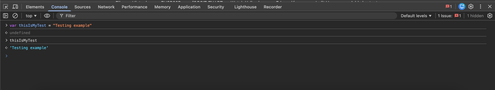
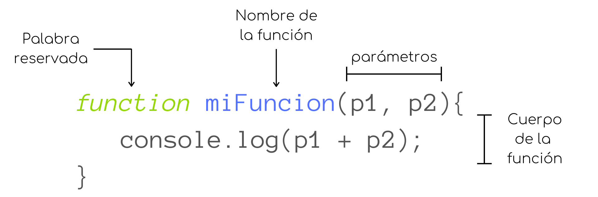
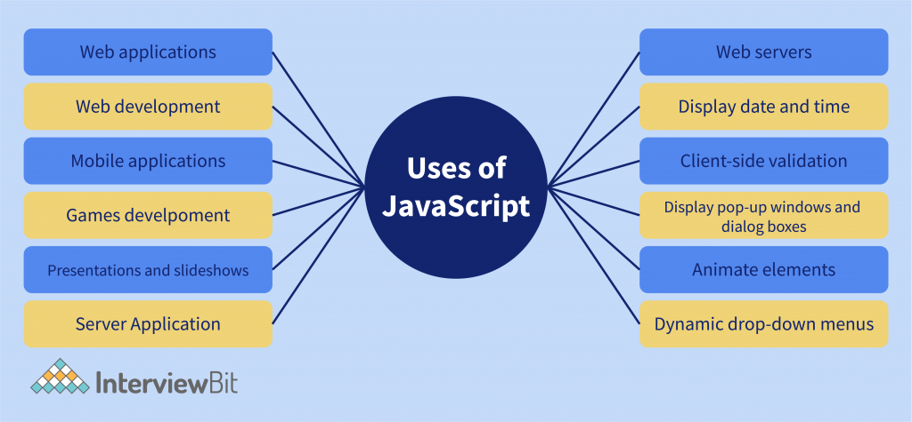
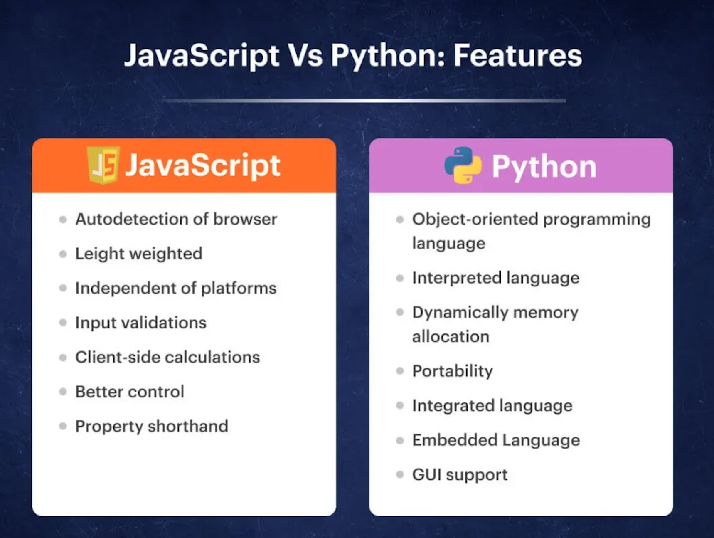

# Pregunta 1

¿Qué diferencia a Javascript de cualquier otro lenguaje de programación?

JavaScript se distingue principalmente por ser el lenguaje nativo e indispensable de los navegadores web, permitiendo interactividad en tiempo real (lado del cliente) sin necesidad de compilación previa. A diferencia de lenguajes compilados, es interpretado, dinámico y asíncrono, ejecutándose directamente donde el usuario interactúa. JavaScript no debe confundirse con Java; son lenguajes distintos con enfoques diferentes, siendo JS más ligero y flexible.

**Se puede ejecutar en cualquier navegador.**\
JavaScript es el único lenguaje que todos los principales navegadores web (como Google Chrome o Safari) entienden de forma nativa. No requiere instalación y se ejecuta instantáneamente en cualquier sitio web, lo que lo convirtió en el lenguaje predeterminado de la web.\
Otros lenguajes (como Python) necesitan capas adicionales para ejecutarse en los navegadores.

_Ejemplo de uso de Javascript en el navegador Chrome:_

<figure><figcaption></figcaption></figure>

**Su diseño se basa en eventos.**\
JavaScript se creó para páginas web interactivas.\
Reacciona a eventos (clics, escritura, desplazamiento).\
Gestiona acciones como las llamadas a la API sin bloquear la aplicación.

**Utiliza herencia basada en prototipos.**\
A diferencia de lenguajes como Java o C++ (que usan clases), JavaScript se basa en prototipos.\
Los objetos heredan directamente de otros objetos.\
Es más flexible, pero también puede resultar confuso al principio. El JavaScript moderno tiene sintaxis de clases, aunque internamente sigue utilizando prototipos.

**Es de flexible y dinámico.**\
No se declaran los tipos de las variables lo que lo hace flexible y rápido de escribir, pero también puede causar errores inesperados. Lenguajes como Java o C# son más estrictos en este aspecto.

**Las funciones son elementos fundamentales.**\
En JavaScript, las funciones pueden almacenarse en variables, pasarse como argumentos y ser devueltas por otras funciones, haciéndolas elementos clave.

_Estructura de una función en JavaScript:_

<figure><figcaption></figcaption></figure>

[Fuente: centrogeo](https://centrogeo.github.io/JSvis/12-Funciones.html)

**Cuenta con un ecosistema enorme (especialmente para la web).**\
No se limita a los navegadores, puede ejecutarse en servidores backend, aplicaciones móviles y de escritorio.

<figure><figcaption></figcaption></figure>

[Fuente: interviewbit](https://www.interviewbit.com/blog/javascript-applications/)

En resumen, JavaScript es diferente porque es el lenguaje de la web, está diseñado para la interacción y la capacidad de respuesta, prioriza la flexibilidad sobre la rigidez y puede ejecutarse tanto del lado del cliente como del servidor.

_Esquema de diferencias entre Javascript y Python, otro lenguaje aprendido en el curso:_

<figure><figcaption></figcaption></figure>

[Fuente:openxcell](https://www.openxcell.com/blog/javascript-vs-python/)

