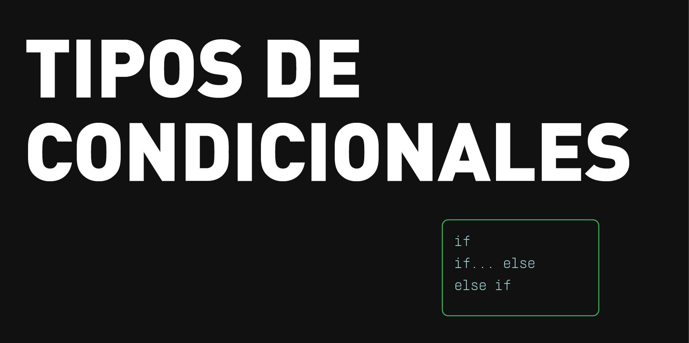
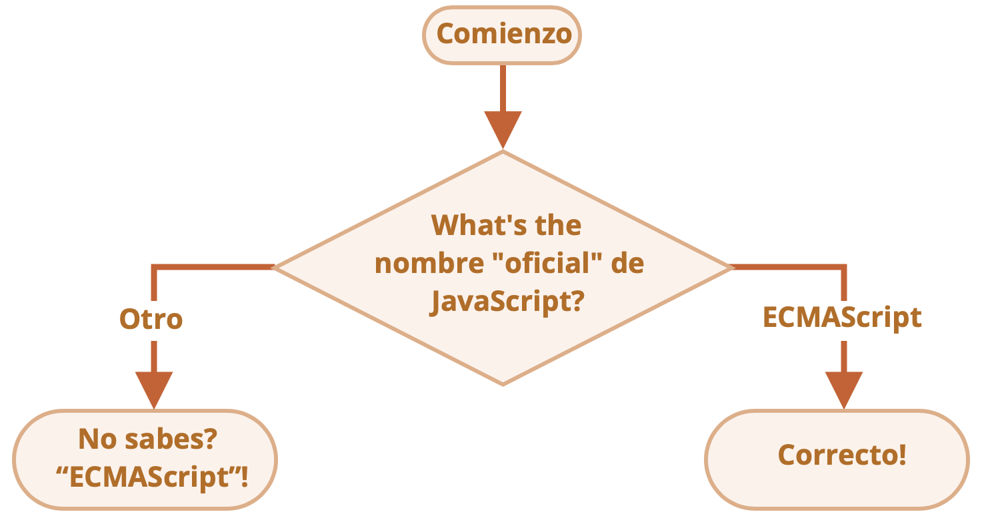

# Pregunta 4

<details open>

<summary>¿Qué es un condicional?</summary>

<figure><figcaption></figcaption></figure>

Los condicionales en JavaScript (if, else, else if, switch) permiten controlar el flujo de ejecución del programa, tomando decisiones basadas en condiciones verdaderas o falsas. Evalúan expresiones lógicas (comparando valores con ==, ===, >, <, etc.) para ejecutar bloques de código específicos.

_Esquema del funcionamiento de los condicionales_

\
[Fuente: Javascript info](https://es.javascript.info/ifelse)

**if**\
Ejecuta código solo si se cumple una condición.

_Ejemplo:_

```
if (age > 18) {
  console.log("Puede votar");
}
```

**else**\
Define un bloque de código a ejecutar si la condición del if es falsa.

_Ejemplo:_

```
if (age > 20) {
  console.log("Puede votar");
} else {
  console.log("Aún no puede votar");
}
```

**else if**\
Para múltiples condiciones, comprueba una nueva condición si la anterior fue falsa.

_Ejemplo:_

```
var nota = 7;

if (nota >= 9) {
  console.log("Sobresaliente");
} else if (nota >= 5) {
  console.log("Aprobado");
} else {
  console.log("Suspenso");
}
```

</details>
