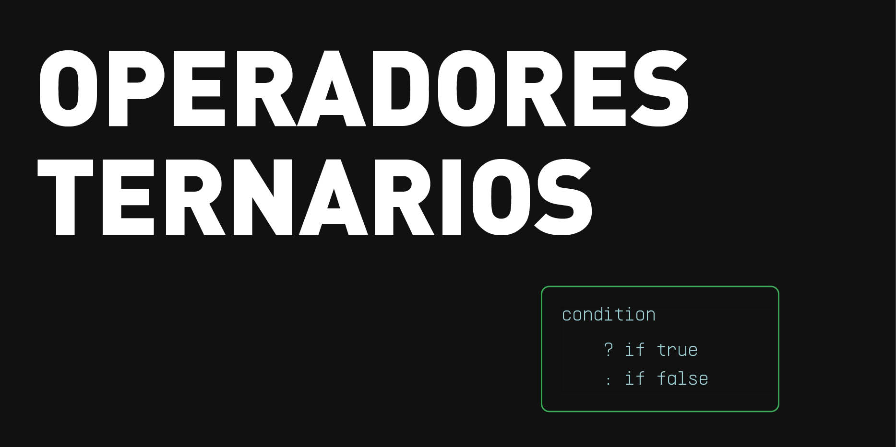

# Pregunta 5

<details open>

<summary>¿Qué es un operador ternario?</summary>

<figure><figcaption></figcaption></figure>

El operador ternario en JavaScript es una forma concisa de escribir sentencias _if...else_ en una sola línea. Evalúa una condición y devuelve un valor si es verdadera, u otro si es falsa. Se llama “ternario” porque utiliza tres partes: `condición ? valor_si_verdadero : valor_si_falso`.

Primero evalúa la condición. Si es verdadera, entonces devolverá el primer valor; si es falsa devolverá el segundo valor.

_Ejemplo:_

```
var edad = 18;
var menu = (edad >= 12) ? "Estándar" : "Niños";

console.log(menu);
```

Sin ser un operador ternario, el código se vería de la siguiente manera:

```
var edad = 18 // Respuesta: Estándar
var menu;
if (edad >= 12) {
  menu = "Estándar";
} else {
  menu = "Niños";
}
```

En resumen, los operadores ternarios hacen el código más conciso, lo cual es útil para asignaciones rápidas basadas en condiciones simples, aunque se recomienda evitarlo si la lógica es compleja, porque puede dificultar la lectura.

</details>
